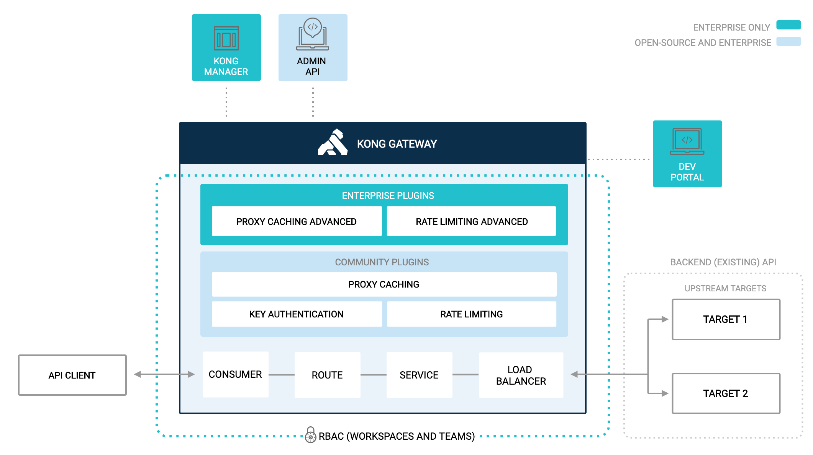

# docker安装

[官网](https://docs.konghq.com/install/docker/?_ga=2.181811879.1832554820.1590497490-1678089697.1590497490) 有完整介绍

创建桥接网络，kong和postgres在同一网段中

```shell
$ docker network create kong-net
```

使用postgres存储，这里需要指定密码负责postgres会启动不起来

```shell
$ docker run -d --name kong-database \
--network=kong-net \
-p 5432:5432 \
-e "POSTGRES_USER=kong" \
-e "POSTGRES_DB=kong" \
-e "POSTGRES_PASSWORD=kong" \
postgres:9.6
```

`docker ps -a` 确认一下是否启动了postgres

初始化数据库

```shell
$ docker run --rm \
     --network=kong-net \
     -e "KONG_DATABASE=postgres" \
     -e "KONG_PG_HOST=kong-database" \
     -e "KONG_PG_PASSWORD=kong" \
     -e "KONG_CASSANDRA_CONTACT_POINTS=kong-database" \
     kong:latest kong migrations bootstrap
```

启动kong

```shell
$ docker run -d --name kong \
     --network=kong-net \
     -e "KONG_DATABASE=postgres" \
     -e "KONG_PG_HOST=kong-database" \
     -e "KONG_PG_PASSWORD=kong" \
     -e "KONG_CASSANDRA_CONTACT_POINTS=kong-database" \
     -e "KONG_PROXY_ACCESS_LOG=/dev/stdout" \
     -e "KONG_ADMIN_ACCESS_LOG=/dev/stdout" \
     -e "KONG_PROXY_ERROR_LOG=/dev/stderr" \
     -e "KONG_ADMIN_ERROR_LOG=/dev/stderr" \
     -e "KONG_ADMIN_LISTEN=0.0.0.0:8001, 0.0.0.0:8444 ssl" \
     -p 8000:8000 \
     -p 8443:8443 \
     -p 127.0.0.1:8001:8001 \
     -p 127.0.0.1:8444:8444 \
     kong:latest
```

查看空是否启动成功:

```shell
$ curl -i http://localhost:8001/
```

安装kong管理界面：

```shell
$ docker run -d -p 1337:1337 \
             --network kong-net \
             --name konga \
             -e "NODE_ENV=production" \
             -e "TOKEN_SECRET=kong" \
             pantsel/konga
```

配置konga，连接kong，因为在同一个网络可以使用容器name做为host连接容器


# 概念

架构图



| Concept/Feature | Description                                                  |
| :-------------- | :----------------------------------------------------------- |
| Service         | 多个 Upstream 的集合，是 Route 的转发目标                    |
| Routes          | 求的转发规则，按照 Hostname 和 PATH，将请求转发给 Service    |
| Consumers       | API 的用户，记录用户信息                                     |
| REST API        | 通过 REST API 进行配置管理，从繁琐的配置文件中解放           |
| 插件            | 提供众多开箱即用的插件，且有易于扩展的自定义插件接口，可以使用 Lua 自行开发插件 |
| 限流            | 可以通过插件实现单个服务某些接口的限流，避免服务过载导致不可用 |
| 鉴权            | 权限控制，IP 黑白名单，同样是 OpenResty 的特性               |
| 负载均衡        | Kong Gateway provides two methods for load balancing: straightforward DNS-based or using a ring-balancer. In this guide, you’ll use a ring-balancer, which requires configuring upstream and target entities. With this method, the adding and removing of backend services is handled by Kong Gateway, and no DNS updates are necessary. |

# 为什么用kong?

- 统一入口：服务端微服务框架中，接口权限验证，IP 限制，限流等在各个服务中都单独实现。没有统一入口，不方便统一管理。
- 易用性，扩展性：服务端技术栈主要是LNMP开发，目前在逐步转型到基于golang微服务技术栈上开发。这是一个灰度迁移的过程，我们需要Proxy能操作简单，管理方便。
- 持续集成发布：互联网 2C 产品，用户无时不刻不在使用服务，同时产品还在不断的迭代，服务每时每刻都可以发布，所以必须要热部署能力，并且是自动化的。支持灰度发布，具有故障转移能力