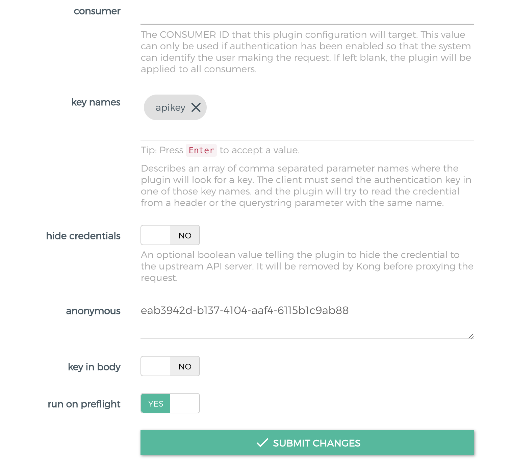

这篇文章目的

-   熟悉kong的配置
-   线上已经在运行openresty，如何无缝接入kong
-   如何配置一个service
-   路由如何匹配，header/path/method/source/destination/SNI 如何配置
-   多个路由同时匹配优先级如何匹配
-   豆瓣是否如何对匿名用户和授权用户进行不同频率限流访问的


[toc]

# 配置


## 注入kong nginx指令

`nginx_http_` 会注入到 `http` 块下面

`nginx_proxy_` 注入到kong 代理端口 `server` 块下面

```nginx
server {
    server_name kong;
    listen 0.0.0.0:8000 reuseport backlog=16384;
    listen 0.0.0.0:8443 ssl http2 reuseport backlog=16384;
	# ...
    # injected nginx_proxy_* directives
    real_ip_header X-Real-IP;
    real_ip_recursive off;
    # ...
}
```

`nginx_admin_` 注入到kong 管理端口 `server` 块下面

```nginx
server {
    server_name kong_admin;
    listen 127.0.0.1:8001 reuseport backlog=16384;
    listen 127.0.0.1:8444 ssl http2 reuseport backlog=16384;
	# ...
    # injected nginx_admin_* directives
    location / {
        default_type application/json;
        content_by_lua_block {
            Kong.admin_content()
        }
        header_filter_by_lua_block {
            Kong.admin_header_filter()
        }
    }
    # ...
}
```

### 配置server块

新增配置文件

```nginx
server {
  listen 2112;
  location / {
    # ...more settings...
    return 200;
  }
}
```

`kong.conf`  `nginx_http_include` 引入此配置文件

```nginx
nginx_http_include = /path/to/your/my-server.kong.conf
```

## 自定义kong nginx模版

极少用到

-   kong.conf 配置命令无法满足
-   线上已经在运行openresty实例，可以使用kong生成配置文件并且引入

### 模版

```
/usr/local/kong
├── nginx-kong.conf
└── nginx.conf
```

重启命令

```
kong start -c kong.conf --nginx-conf custom_nginx.template
```

## 嵌入kong到openresty中

kong下的文件，kong是openresty的插件，索引如果线上已经有openresty在运行的话，可以无缝衔接

```shell
[root@ali conf]# ll /usr/local/kong/
total 292
drwxr-xr-x 2 root   root   4096 May 28 14:31 bin
drwx------ 2 nobody root   4096 May 28 15:30 client_body_temp
-rw-r--r-- 1 root   root 234703 Apr 25 00:45 COPYRIGHT
drwx------ 2 nobody root   4096 May 28 15:30 fastcgi_temp
drwxr-xr-x 3 root   root   4096 May 28 14:31 include
drwxr-xr-x 4 root   root   4096 May 28 14:31 lib
drwxr-xr-x 2 root   root   4096 May 28 15:30 logs
-rw-r--r-- 1 root   root    297 Jun  1 19:18 nginx.conf
-rw-r--r-- 1 root   root   7807 Jun  1 19:18 nginx-kong.conf
-rw-r--r-- 1 root   root   1821 Jun  1 19:18 nginx-kong-stream.conf
drwxr-xr-x 2 root   root   4096 Jun  4 15:25 pids
drwx------ 2 nobody root   4096 May 28 15:30 proxy_temp
drwx------ 2 nobody root   4096 May 28 15:30 scgi_temp
drwxr-xr-x 2 root   root   4096 May 28 15:30 ssl
drwx------ 2 nobody root   4096 May 28 15:30 uwsgi_temp
```

启动方式:

```shell
$ /usr/local/openresty/nginx/sbin/nginx -p /usr/local/kong -c /usr/local/kong/nginx.conf
```

# Proxy

service/route/plugins

## service

可以通过rest api创建一个service，url指向服务

```shell
curl -i -X POST http://localhost:8001/services/ \
    -d 'name=foo-service' \
    -d 'url=http://foo-service.com'
```

url会自动解析:

-   Protocol
-   host
-   port
-   path

重试机制:

-   retries 实现方式是nginx的 [**proxy_next_upstream_tries**](http://nginx.org/en/docs/http/ngx_http_proxy_module.html#proxy_next_upstream_tries) 模块提供的功能，如果service response error，nginx会再次请求upstream

超时时间:

-   Connect timeout
-   Write timeout
-   Read timeout

## route

### 匹配规则

kong支持http/https,tcl/tls,grpc/grpcs协议的代理

-   `http`: `methods`, `hosts`, `headers`, `paths` (and `snis`, if `https`)
-   `tcp`: `sources`, `destinations` (and `snis`, if `tls`)
-   `grpc`: `hosts`, `headers`, `paths` (and `snis`, if `grpcs`)

匹配规则:

-   必须命中所有的字段
-   至少命中字段配置的一个值

```
{
    "hosts": ["example.com", "foo-service.com"],
    "paths": ["/foo", "/bar"],
    "methods": ["GET"]
}
```

以下可以命中路由, host、path、method 均可以匹配到

```
GET /foo/hello/world HTTP/1.1
Host: example.com

GET /bar HTTP/1.1
Host: foo-service.com

GET /foo HTTP/1.1
Host: example.com
```

以下无法命中路由

```
# path没有命中
GET / HTTP/1.1
Host: example.com
# method没有命中
POST /foo HTTP/1.1
Host: example.com
# host没有命中
GET /foo HTTP/1.1
Host: foo.com
```

#### request header

#### host

**指定多个host**

`json`

```shell
curl -i -X POST http://localhost:8001/routes/ \
    -H 'Content-Type: application/json' \
    -d '{"hosts":["example.com", "foo-service.com"]}'
```

`form`

```shell
curl -i -X POST http://localhost:8001/routes/ \
    -d 'hosts[]=example.com' \
    -d 'hosts[]=foo-service.com'
```

**通配符**

只能使用1个*，在左边或最右边

```json
{
    "hosts": ["*.example.com", "service.*"]
}
```

**preserve_host**

kong默认会把请求host替换成upstream的host

upstream target host

```json
{
  "created_at": 1591585408.555,
  "upstream": {
    "id": "6baccef1-2b15-44b8-b1a5-49fce6452487"
  },
  "id": "5b4c2ac4-27c5-42bb-9ec2-41ed6c3c3e75",
  "target": "docker.for.mac.host.internal:9003",
  "weight": 100,
  "health": "HEALTHY"
}
```

打印一下请求头（其他无关请求头忽略）

```json
{
    "code": 0,
    "message": "success",
    "data": {
        "header": {
            "X-Forwarded-For": [
                "172.21.0.1"
            ],
            "X-Forwarded-Host": [
                "douyacun.io"
            ],
            "X-Forwarded-Port": [
                "8000"
            ],
            "X-Forwarded-Proto": [
                "http"
            ],
            "X-Real-Ip": [
                "172.21.0.1"
            ]
        },
        "host": "docker.for.mac.host.internal:9003"
    }
}
```

关闭preserve_host

```json
{
    "code": 0,
    "message": "success",
    "data": {
        "header": {
            "X-Forwarded-For": [
                "172.21.0.1"
            ],
            "X-Forwarded-Host": [
                "douyacun.io"
            ],
            "X-Forwarded-Port": [
                "8000"
            ],
            "X-Forwarded-Proto": [
                "http"
            ],
            "X-Real-Ip": [
                "172.21.0.1"
            ]
        },
        "host": "douyacun.io:8000"
    }
}
```

#### 其他header

kong支持通过header来匹配路由


header中需要添加`version:v1`, 才可以匹配到路由

```shell
GET /api/kong/preserve_host HTTP/1.1
version: v1
```

否则:

```
An invalid response was received from the upstream server
```

#### path

kong url path 匹配必须符合前缀匹配

```json
{
    "paths": ["/api"]
}
```

以下是可以匹配到路由的

```
GET /api/kong/preserve_host HTTP/1.1
Host: douyacun.io
```

默认情况下，kong代理到upstream不会改变url path

**正则路径**

kong支持正则路径和前缀路径匹配

```json
{
    "paths": ["/users/\d+/profile", "/following"]
}
```

```
GET /users/123/profile HTTP/1.1
Host: ...
```

**优先级**

正则匹配可以使用`regex_priority`指定优先级，否则最长前缀路径优先匹配,最多规则有限匹配

```json
[
    {
        "paths": ["/status/\d+"],
        "regex_priority": 0
    },
    {
        "paths": ["/version/\d+/status/\d+"],
        "regex_priority": 6
    },
    {
        "paths": ["/version"],
    },
    {
        "paths": ["/version/any/"],
    }
]
```

1.  `/version/\d+/status/\d+`
2.  `/status/\d+`
3.  `/version/any/`
4.  `/version`

**strip path**

像nginx alias的用法, 去掉前缀路由发送给upstram， 默认是启用状态

`service`

```json
{
  "path": "/",
}
```

path 是 `/api` , 这个path是作为路由前缀的

`route`

```json
{
  "paths": [
    "/api"
  ]
}
```

strip path 开启状态

```
GET /api/articles HTTP/1.1
Host: ...

404 page not found
```

upstream 接收到的请求

```
GET /articles HTTP/1.1
Host: ...
```

**method**

通过请求方法发送过滤路由

`GET`  `POST` `HEAD` `PUT`

**source**

通过请求涞源ip/port过滤路由

`10.1.0.0/16` 


# Authentication

流程：

1. 为service创建一个plugin
2. 创建一个consumer
3. 为consumer创建一个credentials
4. 请求进入时，首先会验证权限

## Consumers

主要用于自定义请求行为，为安卓/iOS创建一个consumer, 或者每个版本、每个平台创建一个consumer。这是一个不透明的概念，所以称为consumer而不是用户

## Anonymous Access

匿名访问和鉴权访问同时存在

对匿名访问进行 低频 限流，对授权用户有 高频限流

流程:

1. 创建service

2. 创建route

3. 创建key-auth plugin

   ```shell
   curl -i -X POST \
      --url http://localhost:8001/services/douyacun/plugins/ \
      --data 'name=key-auth'
   ```

4. 创建anonymous Consumer

   ```shell
   curl -i -X POST \
      --url http://localhost:8001/consumers/ \
      --data "username=anonymous_users"
      
   HTTP/1.1 201 Created
   Content-Type: application/json
   Connection: keep-alive
   
   {
      "username": "anonymous_users",
      "created_at": 1428555626000,
      "id": "bbdf1c48-19dc-4ab7-cae0-ff4f59d87dc9"
   }
   ```

5. 允许anonymous Consumer访问

   ```shell
   curl -i -X PATCH \
      --url http://localhost:8001/plugins/<your-plugin-id> \
      --data "config.anonymous=<上一步anonymous Consumer生成的id>"
   ```

最终结果,原本需要授权的url现在不授权也可以访问了, 授权的consumer也可以正常访问



6 . 针对匿名consumer创建rate limit plugin, 针对授权consumer创建rate limit plugin

```shell
curl -i -X POST \
   --url http://localhost:8001/services/douyacun/plugins/ \
   --data 'name=rate-limiting'
   --data 'config.minute=5'
   --data 'consumer.id=<匿名账户id>'
```

7. 验证 如果没有授权访问，每分钟超过5次就会被限流

```shell
{
    "message": "API rate limit exceeded"
}
```

# Load balancing

DNS-based loadbalancing/ring-balancer

DNS负载均衡，节点不是向kong注册服务，而是向DNS服务器提供注册，kong使用域名就可以了，

DNS各级都有缓存，缓存时间难以把控，不方便做健康检测移除不可用节点 (不推荐使用)

## ring-balancer

使用ring-balancer，需要向kong进行服务注册, 使用http注册以后可以立即获取流量

**upstream**: 虚拟hostname，route可以使用upstream name当作hostname

**target**: ip/port 每个node 都会有weight权重，决定承担多少流量


### upstram

修改target的成本较小，修改upstram的成本较大

slots: 根据最多设置多少个target算出，假设设置10个target，那么slot就是 `10 * 100`,  用于负载均衡算法，(todo:令牌?)

