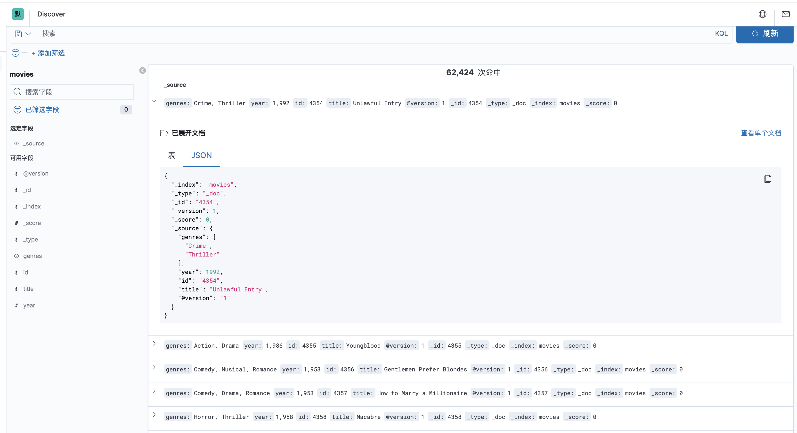

# 文档

- logstash最佳实践(只能入门看看)：https://doc.yonyoucloud.com/doc/logstash-best-practice-cn/index.html

- 官方文档(看过logstash最佳实践以后，官方文档的大概结构就知道了)：https://www.elastic.co/guide/en/logstash/current/index.html

- filter grok 工具(logstash提供正则匹配工具)：http://grokdebug.herokuapp.com/
- logstash下载地址: https://www.elastic.co/cn/downloads/logstash
- 测试数据集: https://grouplens.org/datasets/movielens/

# 定义配置文件

logstash.conf

```conf
input {
        file {
                path => "/Users/liuning/Documents/utils/datasets/movies.csv"
                start_position => "beginning"
                sincedb_path => "/dev/null"
        }
}

filter {
        csv {
                separator => ","
                skip_header => true
                columns => ["id","content","genres"]
        }
        mutate {
                split => ["genres", "|"]
                remove_field => ["path", "message", "@timestamp", "host"]
        }
        mutate {
                split => ["content", "("]
                add_field => { "title" => "%{[content][0]}"}
                add_field => { "year" => "%{[content][1]}"}
        }
        mutate {
                convert => {
                        "year" => "integer"
                }
                strip => ["title"]
                remove_field => ["path", "host","@timestamp","message","content"]
        }
}

output {
        elasticsearch {
                index => "movies"
                document_id => "%{id}"
        }
        stdout { codec => rubydebug }
}
```

- file 读取文件，还支持网络等。
  - path：这里会有坑，如果启动后一直不读取数据，估计是路径出了问题，这里不支持中文，`-`, 老老实实放到一个简单的路径里，不知道下划线支不支持，自己试试
  - start_position：从文件开始的位置读，首次提取数据时，可以这么设置。
  - sincedb_path: logstash读取文件后，会记录文件已经读取的位置，重启也会从上次的位置开始，这里让他写入``/dev/null`,就可以每次从头开始方便调试。
- 从grouplens下载datasets是csv格式的，logstash默认值csv解析
  - autodetect_column_names: 默认是不自动解析表头
  - separator: csv分隔列是用`,`默认是`,`写不写都行
  - quota_char：csv 如果某一列有逗号的话，需要带上`"`表示引用格式，这里自带的csv插件是支持的。如果有解析错乱的话，不用考虑这个。
  - skip_header：跳过表头

- mutate: 修改数据，添加字段，移除字段等等

  - split：分割字段为数据
  - remove_field：移除一些没用的字段
  - strip：去掉空格, php trim() ,python strip()，golang strings.Trim()

- output：输出到哪

  - elasticsearch
    - index:指定索引
    - document_id：指定文档id，否则会默认生成

  - stdout：标准输出到控制台

# 运行

```shell
sudo ./bin/logstash -f logstash.conf
```

这里用sudo，是因为要写入到/dev/null, 需要root权限。

具体 elasticsearch、kibana是如果运行的，看 [elasticsearch docker的安装步骤](安装运行.md)



