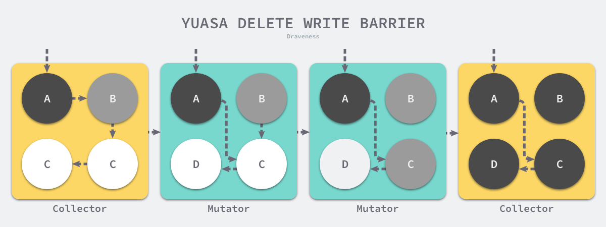

推荐阅读：
- [Golang’s Real-time GC in Theory and Practice](https://making.pusher.com/golangs-real-time-gc-in-theory-and-practice/index.html)
- [三色标记算法 这个是翻译](https://laily.net/article/Golang GC(垃圾回收) - 三色标记算法)
- [Go语言垃圾收集器的实现原理](https://draveness.me/golang/docs/part3-runtime/ch07-memory/golang-garbage-collector/)

真理无穷，这里也是我学习整理别人的笔记来的，快速了解Go的GC设计原理、实现原理，才能做到分析问题时的游刃有余

目录:

[toc]

# 设计原理

C、C++ 语言是需要手动管理内存的，Go内部实现了垃圾自动回收。Go语言是专为并发而生的语言，GC的思想肯定也离不开并发

## 标记清除

### 过程

标记：从根对象触发标记所有可能存活的对象

清除：遍历堆中所有的对象，清除未被标记的对象

### 问题

go早起是这么实现的，标记和清除的过程中需要STW（stop the world）,做不到并发

## 三色标记

三色标记是为了优化 标记清除算法 长时间的STW

### 概念

白色：潜在的垃圾对象

灰色：活跃对象，对象已经被标记，但是子引用还未被处理

黑色：活跃对象，对象已被标记，子引用也全部处理完成

### 过程

1. 所有的对象初始化都是白色
2. 将所有跟对象标记为灰色，放入待处理队列
3. 遍历灰色对象队列，将对象标记为黑色，子引用对象标记为灰色，处理完所有灰色队列
4. 灰色队列为空，只剩白色待清理对象，黑色活跃对象

### 问题

三色标记过程还是无法并发执行，GC过程中用户如果引用了白色对象，本不应该被清除的对象被清除了 -  **悬挂指针**，

## 写屏障

写屏障是为了优化三色标记和用户程序能并发执行，go使用了 `插入写屏障` 和 `删除写屏障`

### 规则

想要在并发和增量的标记算法中保证正确性，需要遵循的规则:

- 强三色不变性：黑色对象不能引用白色对象
- 弱三色不变性：只要存在未标记的能够访问到白色对象的路径，黑色对象就可以引用白色对象。
  - 条件 1: 赋值器修改对象图，导致某一黑色对象引用白色对象
  - 条件 2: 从灰色对象出发，到达白色对象的路径（未处理的引用）被破坏

### 插入写屏障

**原理**：GC过程中，每次引用对象时，都会尝试修改引用对象的颜色，如果是白色标记为灰色

**问题**：栈上的对象在垃圾收集中也会被认为是根对象, 必须为栈上的对象增加写屏障

### 删除写屏障

**原理**：GC过程中，在老对象的引用被删除时，将白色的老对象涂成灰色

**演示过程**

1. 垃圾收集器将A对象标记成黑色，将A对象指向的B对象标记为黑色
2. 用户将A对B的引用改成A对C的引用，删除了对B的引用，触发删除写屏障，因为B已经是灰色不做处理
3. B删除了对C的引用，触发写屏障，C是白色，修改成灰色，保证C和D不被清除，如果没有写屏障，C和D不会成为灰色，会被清除
4. 依次遍历灰色待处理队列，将它们标记为黑色

删除写屏障通过对C重新着色，保证了C对象和下游D对象的存活，保证用户程序正确性

## 增量和并发

增量垃圾收集：增量的标记和清除垃圾，降低应用程序的暂停的最长时间

并发垃圾收集：利用多核资源，在用户程序执行过程中并发标记和清除

### 增量垃圾收集

增量式（Incremental）的垃圾收集是减少程序最长暂停时间的一种方案，它可以将原本时间较长的暂停时间切分成多个更小的 GC 时间片，虽然从垃圾收集开始到结束的时间更长了，但是这也减少了应用程序暂停的最大时间

增量式的垃圾收集需要与三色标记法一起使用，为了保证垃圾收集的正确性，我们需要在垃圾收集开始前打开写屏障，这样用户程序对内存的修改都会先经过写屏障的处理，保证了堆内存中对象关系的强三色不变性或者弱三色不变性。

### 并发垃圾收集

虽然并发收集器能够与用户程序一起运行，但是并不是所有阶段都可以与用户程序一起运行，部分阶段还是需要暂停用户程序的，不过与传统的算法相比，并发的垃圾收集可以将能够并发执行的工作尽量并发执行；

# 实现原理

Go语言垃圾收集的四个阶段：清理终止、标记、标记终止、清理

