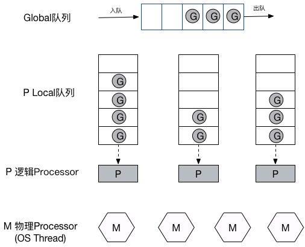

[Toc]

# 线程的实现模型

线程的实现模型主要有 3 种：内核级线程模型、用户级线程模型和两级线程模型（也称混合型线程模型），它们之间最大的差异就在于用户线程与内核调度线程之间的对应关系上；

## 用户级线程模型

用户线程与内核线程 是多对一（N : 1）的映射模型，多个用户线程的一般从属于单个进程并且多线程的调度是由用户自己的线程库来完成，线程的创建、销毁以及多线程之间的协调等操作都是由用户自己的线程库来负责而无须借助系统调用来实现。python的gevent就是属于这种方式，

优势：线程调度在用户层面完成，相比内核级线程可以做的很轻量级，对系统资源的消耗会小很多。

劣势：并不是真正意义上的并发，如果某个线程因为I/O阻塞，被CPU抢占式调度给中断了，该进程内的所有线程都会被阻塞

## 内核级线程模型

用户线程与内核线程是一对一（1 : 1）的映射模型，线程的调度则完全交付给操作系统内核去做，应用程序对线程的创建、终止以及同步都基于内核提供的系统调用来完成。

优势：实现简单，直接借助操作系统内核的线程以及调度器，所以 CPU 可以快速切换调度线程，于是多个线程可以同时运行

劣势：直接借助了操作系统内核来创建、销毁和以及多个线程之间的上下文切换和调度，因此资源成本大幅上涨，且对性能影响很大。

## 两级线程模型

用户线程与内核线程是多对多（N : M）的映射模型，

与用户级线程模型的区别：进程内多个线程可以分别绑定一个内核线程，这点与用户级线程模型相似；

与内核级线程模型的区别：进程的线程并不是与内核线程唯一绑定，可以多个用户线程映射到同一个内核线程，当某个内核线程因为其绑定的用户线程阻塞时，其关联进程中其余用户线程可以与其他内核线程重新绑定调度；

go语言就是基于这种模型实现的，不过更加优雅。go实现了goroutine和内核线程的动态关联。**用户调度器实现用户线程到内核线程的调度，内核调度器实现内核线程到CPU上的调度。**

# G-P-M模型

每一个 OS 线程都有一个固定大小的内存块(一般会是 2MB)来做栈，这个栈会用来存储当前正在被调用或挂起(指在调用其它函数时)的函数的内部变量，对于goroutine来说是很大的内存浪费;

用户线程最后肯定要交给内核线程来执行的，goroutine也不例外，G并不直接绑定内核线程运行，而是由Goroutine Scheduler中的P来作为两者的中介，golang把内核线程抽象成一个数据结构M，所以G是由M通过P调用的，但是在G的层面，P提供了G运行所需的一切资源和环境。在G的层面P就是它的‘CPU’

- G - 每个goroutine对应一个G结构体，存储Goroutine的运行堆栈，状态，以及任务函数，可重用。
- M - Machine, 系统线程抽象，代表着真正执行计算的资源，在绑定有效的 P 后，进入 schedule 循环
- P - Logic Processer逻辑处理器，P提供G的执行环境，如内存分配状态，任务队列等，P的数量决定系统最大可并行G的数量

**线程工作类型**

- CPU绑定：永远不会造成线程可能处于等待状态的情况，不断进行计算
- IO绑定：工作使线程进入等待状态，包括请求通过网络访问资源或对操作系统进行系统调用。需要访问数据库的线程将是IO-Bound

**问什么需要 p 调度上下文，为什么不把调度上下文交给系统线程管理？**

系统上线文切换代价高，在用户进程维护上下文可以保证在当前执行的goroutine在执行系统调用阻塞时，让出当前线程，交给B线程处理，go scheduler 确保充足可执行的线程来运行所有的上下文，线程B等待系统调用返回后仍然是可执行状态。

**schedule是如何平衡各个P之间工作量的？**

p1当前已经运行完了runq中的goroutines，如果系统中还有其他等待运行的goroutines,p1可以从全局runq中取goroutine来运行了，如果全局runq中也没有了，会从其他p中取gouroutines

**GOMAXPROCS**

Go 语言并发模型中的 M 其实表示的是操作系统线程，在默认情况下调度器能够允许创建 `10000` 个线程，但是其中绝大多数的线程都不会执行用户代码（可能陷入系统调用），最多只会有 `GOMAXPROCS` 个线程 M 能够正常运行。

Golang 程序中的最大『可运行』线程数其实就等于 `GOMAXPROCS` 这个变量的值

每一个 Go 语言程序中处理器的数量一定会等于 `GOMAXPROCS`，这是因为调度器在启动时就会创建 `GOMAXPROCS` 个处理器 P，这些处理器会绑定到不同的线程 M 上并为它们调度 Goroutine。

# 推荐阅读

- [Scheduling In Go : Part I - OS Scheduler](https://www.ardanlabs.com/blog/2018/08/scheduling-in-go-part1.html)
- [Scheduling In Go : Part II - Go Scheduler](https://www.ardanlabs.com/blog/2018/08/scheduling-in-go-part2.html)
- [ Scheduling In Go : Part III - Concurrency](https://www.ardanlabs.com/blog/2018/12/scheduling-in-go-part3.html)