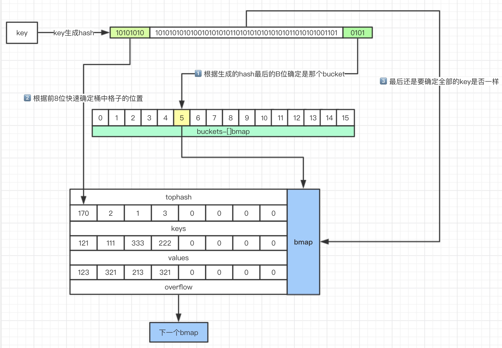

[toc]

通过数据结构、实现原理、读写操作来了解go hashmap

# 数据结构


hash有2个关键数据结构: `hmap` `bmap`

**hmap:  `runtime/map.go`**

```go
type hmap struct {
	count     	int 
	flags     	uint8
	B         	uint8  
	noverflow 	uint16 
	hash0     	uint32 
	buckets    	unsafe.Pointer 
	oldbuckets 	unsafe.Pointer
	nevacuate  	uintptr
	extra 		*mapextra 
}
```

-   `count`  元素数量
-   `B`  2^B个buckets桶
-   `noverflow` buckets溢出桶的数量，近似值
-   `buckets` 桶
-   `oldbuckets` 扩容时指向原buckets桶

**bmap: `runtime/map.go`  `cmd/compile/internal/gc/reflect.go`**

```go
type bmap struct {
    topbits 	[8]uint8
    keys 		[8]keytype
    elems 		[8]elemtype
    pad 		uintptr
    overflow	uintptr
}
```

哈希表中桶的真正结构其实是在编译期间运行的函数 `bmap` 中被『动态』创建的， 代码在`cmd/compile/internal/gc/reflect.go`

-   `topbits` 存储hash值的高8位，通过比对高8位减少键值对访问次数以提高性能
-   `keys` / `elems` 数组

-   `pad` 内存对齐
-   `overflow` 溢出桶，map存储数据过多时使用

# 实现原理

时间复杂度: O(1)

hash函数和hash冲突解决方法

**hash函数**

实现哈希表的关键点在于如何选择哈希函数，哈希函数的选择在很大程度上能够决定哈希表的读写性能，在理想情况下，哈希函数应该能够将不同键映射到不同的索引上，这要求**哈希函数输出范围大于输入范围**，但是由于键的数量会远远大于映射的范围，所以在实际使用时，这个理想的结果是不可能实现的。

**hash冲突**

开放寻址法：对数组中的元素依次比较键值对是否存在于数组

拉链法： 使用数组加上链表


# 读写操作

**读**



-   计算出key的hash
-   用最后的“B”位来确定在哪个桶（“B”就是前面说的那个，B为4，就有16个桶，0101用十进制表示为5，所以在5号桶）
-   根据key的前8位快速确定是在哪个格子（额外说明一下，在bmap中存放了每个key对应的tophash，是key的前8位）
-   最终还是需要比对key完整的hash是否匹配，如果匹配则获取对应value
-   如果都没有找到，就去下一个overflow找

**写**

-   通过key的后“B”位确定是哪一个桶
-   通过key的前8位快速确定是否已经存在
-   最终确定存放位置，如果8个格子已经满了，没地方放了，那么就重新创建一个bmap作为溢出桶连接在overflow

**扩容**

条件：

-   装载因子大于6.5
-   溢出桶 大于15个

```go
func mapassign(t *maptype, h *hmap, key unsafe.Pointer) unsafe.Pointer {
	...
	if !h.growing() && (overLoadFactor(h.count+1, h.B) || tooManyOverflowBuckets(h.noverflow, h.B)) {
		hashGrow(t, h)
		goto again
	}
	...
}
```

方式：

-   等量扩容
-   翻倍扩容

