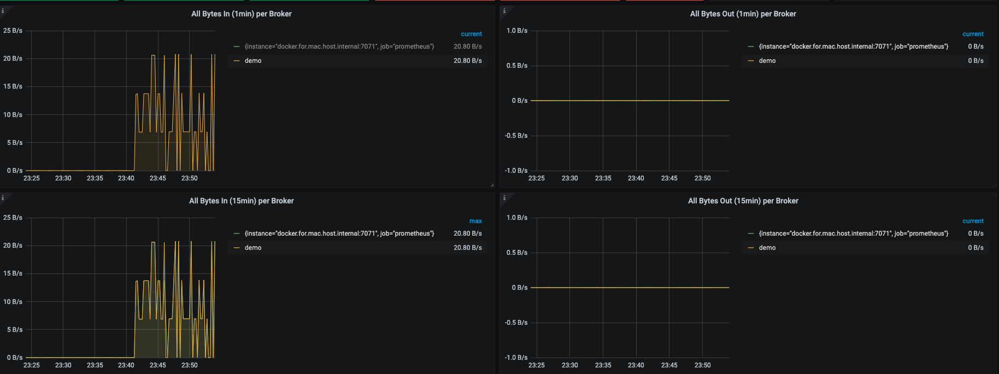

看了一下其他kafka监控文章都没有自信说明kafka各项指标，指标含义，以及如何收集，再次自信整理了一下kafka监控指标、含义以及如何收集：

- broker度量指标
    - ISR （in-sync replication） 未出在未复制的分区数量
    - 活跃控制器数量
    - 请求处理器空闲率 
- topic度量指标
    - 主题流入字节速率
    - 主题流出字节速率
    - 主题流入消息速率
- partition度量指标
    - 分区数量
    - 首领分区数量
    - 离线分区数量
    - 分区占用磁盘大小
    - 分区文件数量
    - 分区消息最大偏移量
    - 分区消息最小偏移量
- 生产者度量指标
    - 每秒钟消息的字节数
    - 每秒钟消息的数量
    - 每秒钟生产者发送给 broker 的请求数
    - 单个请求里所包含的消息平均个数
    - 发送一个生产者请求到 broker 所需要 的平均时间
    - 消息发送给kafka之前在生产者客户端等待的平均毫秒数
- 消费者度量指标
    - 从消费者向 broker 发送请求所 需要的时间
    - 消费者每秒发出请求的数量
    - 请求的平均字节数
    - 每个请求的平均消息个数
    - 每秒读取的消息字节数
    - 每秒读取的消息个数
- 操作系统

    - CPU
    - 网络输入吞吐量
    - 网络输出吞吐量
    - 磁盘平均等待时间
    - 磁盘使用百分比


grafana dashboards

https://grafana.com/grafana/dashboards/10973

# jmx-exporter 指标收集

prometheus 提供了 jmx_exporter 来收集 kafka 指标

Github：[https://github.com/prometheus/jmx_exporter](https://github.com/prometheus/jmx_exporter)

配置文件：[https://github.com/prometheus/jmx_exporter/blob/master/example_configs/kafka-2_0_0.yml](https://github.com/prometheus/jmx_exporter/blob/master/example_configs/kafka-2_0_0.yml)

配合kafka启动脚本，修改 `bin/kafka_server_start.sh`，添加常量，只需要在一个实例中添加即可

```shell
export KAFKA_OPTS="-javaagent:$base_dir/jmx_prometheus_javaagent-0.15.0.jar=7071:$conf_dir/kafka-2_0_0.yml"
```

prometheus targets 收集 metrics

```yaml
static_configs:
  - targets: ['127.0.0.1:7071']
```

> 如果是docker启动的prometheus，而kafka是宿主机启动的话

```yaml
static_configs:
  - targets: ['docker.for.mac.host.internal:7071']
```

# broker 度量指标

**under replicated partitions : 未复制分区数量**

JMX MBean:  `kafka.server:type=RelicaManager,name=UnderReplicatedPartitions`

Prometheus: 

- `kafka_cluster_partition_underreplicated`  各个topic patition
- `kafka_server_replicamanager_underreplicatedpartitions`  总

如果说 broker 只有一个可监控的度量指标，那么它一定是指同步分区的数量（ISR）。

该 topic 下的 partition，其中副本处于失效或者失败的比率。失败或者失效是指副本不处于 ISR 队列中。目前控制副本是否处于 ISR 中由 **replica.log.max.ms** 这个参数控制。

Kafka具有副本的功能，不同的broker上保存了每个parition的不同副本，具体存在几台broker上，是由配置的副本因子所决定的。尽管有大量副本的存在，但kafka只会在最初把数据写入partition的leader（一个leader多个follower），leader是随机的在ISR（in-sync replicas）池（所有处于同步状态的partition副本）中选举出来的。另外，消费者只会读取partition leader，这样follower副本将作为备份存在，以保证kafka的高可用性，从而防某个broker挂掉。

如果 `Under Replicated Partitions` 非同步数量一直不变说明存在broker已经下线了，我启动了3个broker，topic demo partition 3 replication-factor 3, 主动下线 broker-id: 2


`./kafka-topics.sh --describe --under-replicated-partitions`  可以查看具体是哪个broker出现了问题

```
	Topic: demo	Partition: 0	Leader: 1	Replicas: 1,0,2	Isr: 1,0
	Topic: demo	Partition: 1	Leader: 1	Replicas: 2,1,0	Isr: 1,0
	Topic: demo	Partition: 2	Leader: 0	Replicas: 0,2,1	Isr: 1,0
```

**active controller count : 活跃控制器数量**

控制器：负责分区副本leader选举，第一个broker通过向zookeeper创建一个临时节点 /controller 让自己成为控制器，控制器只能有一个副本。

当broker离开集群后，有些分区副本就会失去leader，控制器会遍历剩下的分区，选举新leader并通知素有分区

当有新broker加入集群后，控制器会检查该broker是否包含现有分区的副本

JMX MBean: `kafka.controller:type=KafkaController,name=ActiveControllerCount`

Prometheus: `kafka_controller_kafkacontroller_activecontrollercount`

如果集群没有控制器，集群就无法对主题和分区创建，broker故障作出响应

**request handler avg idle percent : 请求处理空闲率**

Kafka 使用了两个线程池来处理客户端的请求:网络处理器线程池和请求处理器线程池。 网络处理器线程池负责通过网络读入和写出数据

JMX MBean: `kafka.server:type=KafkaRequestHandlerPool,name=RequestHandlerAvgIdlePercent`

Prometheus: `kafka_server_kafkarequesthandlerpool_requesthandleravgidlepercent_count`

数值越低，说明broker的负载越高。如果空闲百分比低于20%，说明存在潜在的问题，如果低于10%，说明出现了性能问题

# topic 度量指标



**bytes in : 主题流入字节**

broker接收的生成者客户端消息流量 字节数据

JMX MBean：`kafka.server:type=BrokerTopicMetrics,name=BytesInPerSec`

Prometheus：`kafka_server_brokertopicmetrics_bytesin_total`

OneMinuteRate: 前1分钟的平均值 `irate(kafka_server_brokertopicmetrics_bytesin_total[1m])`

FiveMinuteRate: 前5分钟的平均值 `irate(kafka_server_brokertopicmetrics_bytesin_total[5m])`

FifeenMinuteRate: 前15分钟的平均值 `irate(kafka_server_brokertopicmetrics_bytesin_total[15m])`

**bytes out : 主题流出字节**

流出字节速 率显示的是消费者从 broker 读取消息的速率

JMX MBean: `kafka.server:type=BrokerTopicMetrics,name=BytesOutPerSec`

Prometheus: `kafka_server_brokertopicmetrics_bytesout_total`

**messages in 主题流入的消息**

消息速率：每秒生成消息的个数

JMX MBean: `kafka.server:type=BrokerTopicMetrics,name=MessageInPerSec`

Prometheus: `kafka_server_brokertopicmetrics_messagesin_total`

> 为什么没有消息的流出速率?
>
> brocker是将整个消息批次发送消费者，并没有展开批次，也就不会计算消费消息的数量

# Partition 分区指标


**partition count 分区数量**

分配给broker的分区总数，包括broker的每一个分区副本，不管是首领还是副本

JMX MBean: `kafka.server:type=ReplicaManager,name=PartitionCount`

Prometheus: `kafka_server_replicamanager_partitioncount`

**leader count 首领数量**

broker 首领分区数量

JMX MBean: `kafka.server:type=ReplicaManager,name=LeaderCount`

Prometheus: `kafka_server_replicamanager_leadercount`


