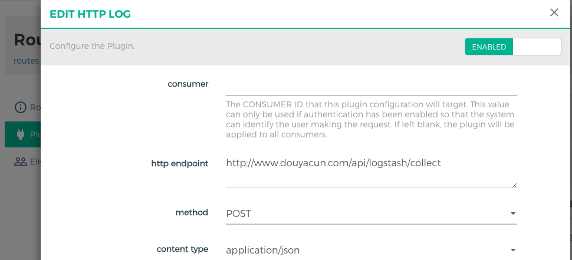
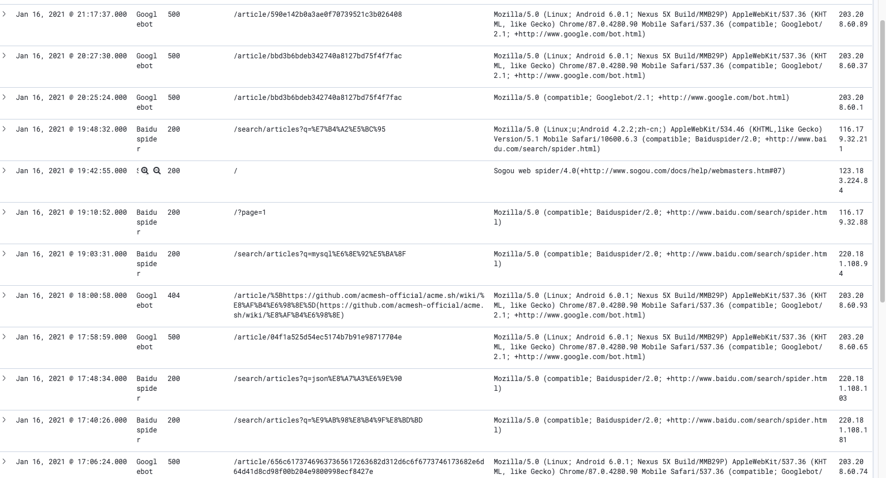

背景：博客文章SEO优化，百度和Google的收录速度比较慢，需要统计百度和Goole爬虫每天的请求量，博客使用kong作为网关层，代理请求服务

分析：

- 为了避免跨域，后端服务和前端服务均使用同一域名，kong 根据 path 路由到不同 service 上
- 统计爬虫的请求，正常用户请求需要过滤掉，爬虫会在 User-Agent 指明来自哪里
- 数据存储与报表展示，这里因为后端使用的es存储配套kibana，图表的展示做起来也相对简单

#### kong日志插件 http-log

首先要解决的是不同域名，不同路径，而kong的插件是支持到**路由**层级的。

请求方法：post/put/patch 

http endpoint：接收日志的接口地址（此路由已经限制ip了）



#### 统计爬虫请求

通过 User-Agent 来识别各大搜索引擎的爬虫，贴下 http-log 插件发送过来的原始数据（只是请求部分，全部太长了）

```json
{
    "request": {
        "querystring": {},
        "size": 458,
        "uri": "/article/7BVuR3ABe5zSv27mtyuf",
        "url": "https://www.douyacun.com:8443/article/7BVuR3ABe5zSv27mtyuf",
        "headers": {
            "accept": "*/*,application/signed-exchange;v=b3",
            "accept-encoding": "gzip,deflate,br",
            "amp-cache-transform": "google;v=\"1..2\"",
            "connection": "keep-alive",
            "from": "googlebot(at)googlebot.com",
            "host": "www.douyacun.com",
            "user-agent": "Mozilla/5.0 (Linux; Android 6.0.1; Nexus 5X Build/MMB29P) AppleWebKit/537.36 (KHTML, like Gecko) Chrome/87.0.4280.90 Mobile Safari/537.36 (compatible; Googlebot/2.1; +http://www.google.com/bot.html)",
            "x-anonymous-consumer": "true",
            "x-consumer-id": "762663d6-f465-4549-a4f8-ac4ae51f7f0e",
            "x-consumer-username": "anonymous"
        },
        "method": "GET"
    }
}
```

需要统计多个搜索引擎的请求，选择使用正则来过滤正常请求，爬虫的请求正常入库

```regexp
(Baiduspider|Googlebot|Googlebot|360Spider|Sogou|Bingbot)
```

顺便贴一下go定义的结构体，只是取了一下我认为需要的数据

```go
type KongHttpLog struct {
	Latencies struct {
		Request json.Number `json:"request"`
		Kong    json.Number `json:"kong"`
		Proxy   json.Number `json:"proxy"`
	} `json:"latencies"`
	Request struct {
		Querystring map[string]string `json:"querystring"`
		Size        json.Number       `json:"size"`
		Uri         string            `json:"uri"`
		Url         string            `json:"url"`
		Headers     map[string]string `json:"headers"`
		Method      string            `json:"method"`
	} `json:"request"`
	ClientIp string  `json:"client_ip"`
	Tries    []tries `json:"tries"`
	Response struct {
		Headers map[string]string `json:"headers"`
		Status  json.Number       `json:"status"`
		Size    json.Number       `json:"size"`
	}
	Spider string `json:"spider"`
	Date   string `json:"date"`
}
```

#### ES 存储数据

正常来说搜索引擎的爬虫媒体不会有大量的请求，我们定义储存策略是：按月统计，保留3个月，定期删除3个月之前的数据

还有个的问题是，每个月需要创建index设置mapping否则字段类型都是es猜测出来的，这里es提供了 [index template](https://www.elastic.co/guide/en/elasticsearch/reference/7.10/indices-templates.html) 如果index 命名命中了 `index_patterns` ，如果不存在会自动按照template创建index, 避免了需要自动脚本来创建index

```json
{
  "index_patterns": ["spider_*"],  
  "mappings": {
    "properties": {
      "date": {
        "type": "date"
      },
      "spider": {
        "type": "keyword"
      }
    }
  }
}
```

使用kibana做个折线图，每日观察一下趋势


so: kong收集搜索引擎爬虫每日收录哪些网页的目的已经实现了

刚加完3个小时后，我就统计到了Google的访问全部500了～～～～，一万个草泥马



