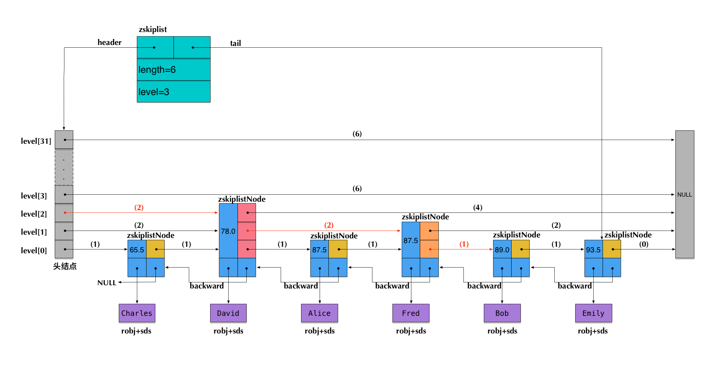

# 多层链表索引


每相邻两个节点增加一个指针，让指针指向下下个节点，相比链表查询，减少了一半


继续为每相邻的两个节点都增加一个指针，产生第三层链表；查找过程类似于2分查找

问题:\
查找是O(log n)，但是插入会打乱上下相邻两层链表上节点个数严格的2:1对应关系

# skiplist
- 每一个节点的层数是随机出来的，新插入一个节点不会影响其他节点的层数
> skiplist 插入操作只需要修改插入节点前后的操作，不需要对很多节点做操作,降低了插入操作的复杂度，AVL树和红黑树需要做旋转操作插入和删除的复杂度为O(log n)

# skiplist 随机层数算法
- 每个节点肯定都有第一层指针
- 如果有一个节点有第i层（i>1）指针（即节点已经在第一层到第i层的链表中)，那么它有(i+1)的概率为p(redis 1/4)
- 节点最大的层数为不允许超过最大层数， MAX_LEVEl(redis 32)
- 产生越高的节点层数，概率越低

# skiplist与平衡树、哈希表的比较
- 范围查找：
  - 哈希表不是有序的、只适合单个key查找。不适合范围查找
  - 平衡树(AVL、红黑树)，找到小值以后，还必须中序遍历找到大值
  - skiplist只要找到小值，只需要在1层链表遍历就可以实现
- 单个查找：
  - skiplist和平衡树复杂度都是O(log n)，大体相当
  - 哈希表冲突率低的话，复杂度为O(1)
- 插入和删除操作：
  - 平衡树的插入和删除会引起子树的调整，需要进行旋转操作老维持平衡
  - skiplist的插入和删除值需要修改相邻节点操作的指针
- 内存占用：
  - 平衡树每个节点包含2个指针(分别指向左右子树)
  - 而skiplist每个节点包含的指针数目为1/(1-p),reids p为1/4，每个节点平均为1.33个指针


# redis skiplist 结构定义
```c
#define ZSKIPLIST_MAXLEVEL 32
#define ZSKIPLIST_P 0.25

// 跳跃表 节点
typedef struct zskiplistNode {
    robj *obj;// 成员对象
    double score; // 分值
    zskiplistNode *backward;// 后退指针
    struct zskiplistLevel {
        zskiplistNode *forward; // 前进指针
        unsinged int span;// 跨度
    } level[];
} zskiplistNode;

// 跳跃表
typedef struct zskiplist {
    struct zskiplistNode *head, *tail;// 表头节点、表尾节点
    unsigned long length;// 表中节点数量
    int level;// 表中层数最大的节点的层数
}
```

# 重点
- 跳跃表是有序集合的底层实现之一，除此之外没有其他用的地方
- 每个跳跃节点的层高都是1-32之间的随机数
- 在同一个跳跃表，多个节点可以包含相同的分值，每个节点的对象必须是唯一的
- 跳跃表的节点按照分值大小进行排序




# 扩展阅读
- [Redis内部数据结构详解(6)——skiplist](http://zhangtielei.com/posts/blog-redis-skiplist.html)